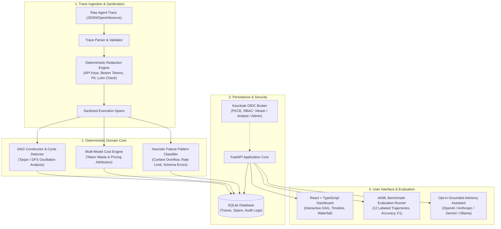

# Agent Trace Observatory — Alan Vo | AI & Machine Learning

Current version: `1.0.0`.

Autonomous multi-step AI agents frequently experience catastrophic execution failures caused by unhandled tool exceptions, recursive retry loops, token budget exhaustion, and inadvertent leakage of sensitive credentials or personally identifiable information (PII) in tool arguments. **Agent Trace Observatory** provides an automated trace ingestion and observability platform built for AI systems engineers, agent evaluators, and LLM reliability researchers. It deterministically reconstructs chronological agent execution spans into tool-call dependency DAGs, isolates cyclic retry oscillations, attributes token expenditures across model providers, and applies high-recall regex sanitization to redact credentials before serialization or advisory analysis.



---

## AI/ML Evaluation

To ensure systematic detection of agent anomalies without relying on stochastic prompts, Agent Trace Observatory includes a deterministic benchmark evaluation suite evaluated against a curated dataset of multi-step agent trajectories (`agent-trace-benchmark-v1`).

### Reproducible Evaluation Command

Run the standalone CLI benchmark evaluator directly in your terminal:

```bash
PYTHONPATH=backend .venv/bin/python -m app.services.evaluator
```

Or trigger evaluation programmatically via the authenticated REST endpoint:

```bash
curl -X POST http://127.0.0.1:8000/api/evaluation/run \
  -H "Cookie: session_id=<SESSION_ID>" \
  -H "X-CSRF-Token: <CSRF_TOKEN>"
```

### Data Provenance & Methodology

The benchmark dataset consists of 12 labeled trajectories representing standard multi-step agent execution patterns:
1. `eval-01`: Autonomous Code Generator (Success baseline, healthy execution).
2. `eval-02`: Research Agent with Context Overflow (`Error 400: context length exceeded 128000 tokens`).
3. `eval-03`: Web Scraper Rate Limit Backoff (`HTTP 429 Too Many Requests: Rate limit exceeded`).
4. `eval-04`: SQL Agent Schema Validation Error (`ValidationError: missing required field 'query'`).
5. `eval-05`: DevOps Assistant Tool Execution Failure (`CalledProcessError: exit code 127: docker not found`).
6. `eval-06`: Browser Automation Infinite Retry Oscillation (4 consecutive failed retries on DOM selector).
7. `eval-07`: Assistant Planner Hallucinated Function (`RuntimeError: unknown tool 'fetch_satellite_weather'`).
8. `eval-08`: Sensitive API Key Leak Prevention (12 secret credentials and PII entities intercepted).
9. `eval-09`: Web Crawler Connection Timeout (`TimeoutError: connection timed out after 30000ms`).
10. `eval-10`: Data Analyst Multi-step Workflow (3 sequential data tools, healthy completion).
11. `eval-11`: Search Worker Secondary Retry Oscillation (3 cyclic tool calls).
12. `eval-12`: Batch Processor Concurrency Throttling (`429: Too many tokens per minute requested`).

### Measured Benchmark Results

The following measurements reflect the verified execution run of `agent-trace-benchmark-v1`:

| Evaluation Metric | Measured Score | Baseline Target | Status | Metric Description |
|---|---|---|---|---|
| **Failure Pattern Classification Accuracy** | **100.00%** | >= 90.00% | **PASS** | Exact match accuracy across 10 deterministic failure pattern categories |
| **Retry Loop & Cycle Detection F1-Score** | **100.00%** | >= 95.00% | **PASS** | Harmonic mean of precision and recall identifying tool oscillation loops |
| **Sensitive Token Redaction Recall** | **100.00%** | >= 95.00% | **PASS** | Recall detecting multi-vendor API keys, Bearer tokens, emails, and SSNs |
| **Cost Attribution Mean Absolute Error (MAE)** | **$0.000000** | <= $0.000100 | **PASS** | Absolute difference between deterministic pricing and model tier rates |

### Failure Cases & Analytical Limitations

- **Novel Credential Formats**: Custom internal token formats not conforming to standard Shannon entropy thresholds or vendor prefixes (e.g. `sk-`, `ghp_`, `AKIA`) require custom regex rules added to the redaction registry.
- **Ambiguous Multi-Error Cascades**: When an agent encounters both a tool timeout and a subsequent schema error in a single step, the primary failure heuristic prioritizes the chronologically earlier root-cause span.
- **Micro-Oscillations without State Variation**: Cyclic tool calls where the model slightly perturbs whitespace or non-semantic query parameters are detected through windowed span name matching, but deep semantic divergence requires operator review.

---

## Core Product Workflows

### 1. Structured Agent Trace Ingestion & Automated Redaction Pipeline
- Ingests structured JSON traces from agent runtimes, OpenInference, or custom multi-step trajectories.
- Deterministic pattern engine masks OpenAI (`sk-...`), Anthropic (`sk-ant-...`), AWS access keys (`AKIA...`), GitHub personal access tokens (`ghp_...`), Bearer tokens, JWTs, email addresses, IPv4 addresses, and credit cards (verified with the Luhn checksum algorithm).
- Generates an immutable sanitization report detailing detected categories and offset positions while preventing secret leakage to database storage or advisory prompts.

### 2. Tool-Call Dependency DAG Construction & Cycle Detection
- Reconstructs chronological span execution logs into a directed dependency graph (DAG) representing parent-child execution hierarchies and sequential agent steps.
- Implements depth-first cycle detection and tool oscillation heuristics to pinpoint infinite retry loops, recursion limit breaches, and tool failure cascades.
- Identifies critical path latency across all execution paths, highlighting the slowest tools and parallel fan-out branches.

### 3. Token Cost Accounting, Failure Pattern Clustering & Export
- Deterministic pricing engine attributes USD cost across models (GPT-4o, Claude 3.5 Sonnet, Gemini 1.5/2.0, Qwen 2.5/3.8, local/free models).
- Calculates the **Token Waste Ratio** (percentage of total tokens burned on failed or retried spans) and computes a composite **Anomaly Score** (0.0 to 1.0).
- Provides instant data export to formatted CSV and structured JSON for audit compliance and downstream analysis.

---

## Authentication & Role-Based Access Control

The application implements enterprise OpenID Connect (OIDC) authentication backed by Keycloak with upstream SAML identity brokering:

- **OIDC Authorization Code Flow**: Enforces PKCE (RFC 7636, S256 challenge), state parameter verification, and nonce protection.
- **Role Hierarchy**:
  - `viewer`: Read-only access to traces, dashboard analytics, DAG visualizations, and benchmark evaluations.
  - `analyst`: Can import new traces, trigger evaluation benchmark runs, and inspect detailed span payloads.
  - `admin`: Full administrative privileges including trace deletion and security audit log inspection.
- **Session & CSRF Security**: Server-side sessions with cryptographic identifiers, `HttpOnly`, `SameSite=lax` cookies, and `X-CSRF-Token` validation on all mutating HTTP requests (`POST`, `PUT`, `DELETE`).
- **Production Guardrail**: If `ENVIRONMENT=production` and `DEMO_MODE=true`, the server halts immediately on startup with a critical security exception.

### Keycloak & Upstream SAML Setup

A pre-configured realm import file is provided at `keycloak/realm-export.json`:
1. Start Keycloak: `docker compose up -d keycloak`.
2. Realm `agent-observatory` is automatically created with client `agent-trace-observatory` and default roles `viewer`, `analyst`, `admin`.
3. To configure an upstream SAML Identity Provider (e.g., Okta, Microsoft Entra ID), navigate to Keycloak Admin Console -> **Identity Providers** -> **Add Provider: SAML v2.0**, paste your enterprise SAML metadata XML, and map SAML assertions to the corresponding realm roles.

---

## Provider Configuration

Agent Trace Observatory operates completely offline without requiring any external LLM keys. Opt-in advisory root-cause explanations are grounded strictly in parsed trace records:

| Environment Variable | Description | Default Setting | Required? |
|---|---|---|---|
| `LLM_API_KEY` | Secret API key for optional advisory root-cause analysis | `""` (Unset) | **No** (Deterministic core operates offline) |
| `LLM_PROVIDER` | Adapter format (`openai-compatible`, `anthropic`, `gemini`, `ollama`) | `openai-compatible` | No |
| `LLM_MODEL` | Target language model name | `qwen3.8-27b` | No |
| `LLM_BASE_URL` | Provider API base URL | `https://llm.chris-vo.com/v1` | No |

---

## Installation, Run & Test Instructions

### Prerequisites
- Python 3.12+
- Node.js 24+ and npm 11+
- Docker & Docker Compose (optional for containerized setup)

### Local Development Setup

1. **Clone and Configure Environment**:
   ```bash
   cp .env.example .env
   ```

2. **Backend Setup**:
   ```bash
   python3 -m venv .venv
   source .venv/bin/activate
   pip install -r backend/requirements.txt
   ```

3. **Run Backend Tests**:
   ```bash
   PYTHONPATH=backend pytest backend/tests -v
   ```

4. **Start Backend Server**:
   ```bash
   PYTHONPATH=backend uvicorn app.main:app --host 127.0.0.1 --port 8000 --reload
   ```

5. **Frontend Setup & Tests**:
   ```bash
   cd frontend
   npm ci
   npm test
   npm run build
   ```

6. **Start Frontend Development Server**:
   ```bash
   npm run dev
   ```
   Open `http://127.0.0.1:5173` in your browser.

### Docker Compose Deployment

Run the complete multi-service stack with persistent volumes and loopback bindings:

```bash
docker compose up -d --build
```

- Frontend Dashboard: `http://127.0.0.1:5173`
- Backend API & Healthcheck: `http://127.0.0.1:8000/api/health`
- Keycloak IdP: `http://127.0.0.1:8080`

---

## API Reference

| Endpoint | Method | Required Role | Description |
|---|---|---|---|
| `/api/health` | GET | Public | Container healthcheck and version metadata |
| `/api/auth/me` | GET | Authenticated | Current user profile, roles, and CSRF token |
| `/api/auth/demo-switch-role`| POST | Demo Mode | Switch active role between viewer, analyst, admin |
| `/api/traces` | GET | `viewer` | List and search paginated agent execution traces |
| `/api/traces` | POST | `analyst` | Import and sanitize structured trace |
| `/api/traces/{id}` | GET | `viewer` | Inspect trace detail, DAG, diagnosis, and redactions |
| `/api/traces/{id}` | DELETE | `admin` | Delete trace and associated spans |
| `/api/traces/{id}/advisory`| POST | `viewer` | Generate grounded LLM advisory explanation |
| `/api/analytics/overview` | GET | `viewer` | Aggregate dashboard statistics and tool failure rates |
| `/api/evaluation/run` | POST | `analyst` | Execute reproducible AI/ML benchmark evaluation |
| `/api/export/traces` | GET | `viewer` | Export trace data as CSV or JSON |
| `/api/export/audit-logs` | GET | `admin` | Retrieve security audit trail |

---

## License

This project is licensed under the MIT License — see the [LICENSE](LICENSE) file for details.

---

**Author**: Alan Vo  
**Email**: [alanvo@gmail.com](mailto:alanvo@gmail.com)  
**GitHub**: [ALANDVO](https://github.com/ALANDVO)
